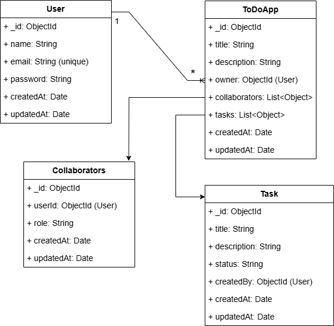

# 🛡️ NestJS Collaborative ToDo App

A secure, efficient, and collaborative ToDo app backend built with **NestJS**, **MongoDB (Mongoose)**, and **JWT Auth**.

---

## 🚀 Features

### 🔐 Authentication
- Signup & Login with JWT (Access + Refresh Tokens)
- Passwords hashed using `bcryptjs`
- Token refresh & logout support

### 🗂️ ToDo App
- Create personal ToDo apps
- Invite collaborators with role: `viewer` or `editor`
- Only **owner** or **editors** can modify tasks

### ✅ Tasks (Embedded in ToDo App)
- Add, update, delete tasks (embedded subdocuments)
- **Paginated** task fetch via query params: `pageNumber`, `pageSize`
- Query optimizations:
  - Use of `$push` with `$slice` to get newly added task
  - Atomic updates with `findOneAndUpdate` for subdocuments
  - Mongo projections to reduce response size

### 🛡️ AuthGuard
- All ToDo and Task routes are protected with `@UseGuards(AuthGuard)`
- Access control enforced on service level with helper `canEdit()`

---

## 🧑‍💻 Getting Started

### 1. Clone the repo

```bash
git clone https://github.com/rafi-ruetcse17/backend.git


## Compile and run the project

```bash
# development
$ npm run start

# watch mode
$ npm run start:dev

# production mode
$ npm run start:prod
```

## Schema Design



---

## API Endpoints 

Base URL: http://localhost:4000

---

POST /auth/signup
------------------
Description: Register a new user.
```
Request Body:
{
  "name": "John Doe",
  "email": "john@example.com",
  "password": "yourpassword"
}

Success Response (201)
```
---

POST /auth/login
-----------------
Description: Login user and return tokens.
```
Request Body:
{
  "email": "john@example.com",
  "password": "yourpassword"
}

Success Response (200):
{
  "accessToken": "<JWT_ACCESS_TOKEN>",
  "refreshToken": "<JWT_REFRESH_TOKEN>"
}
```
---

POST /auth/refresh
-------------------
Description: Generate a new access token using a refresh token.
```
Request Body:
{
  "refreshToken": "<JWT_REFRESH_TOKEN>"
}

Success Response (200):
{
  "accessToken": "<NEW_JWT_ACCESS_TOKEN>"
}
```
---

POST /api/todo-apps/create
-------------------
Description: Creat a Todo App.

```
Request Body:
{
  "title": "First App",
  "owner": "682cba10b7b0df2f1f440b22"
}

Success Response (200):
{
  "title": "First App",
  "owner": "682cba10b7b0df2f1f440b22",
  "_id": "682ee77a705c56ffa8923ad3",
  "collaborators": [],
  "createdAt": "2025-05-22T08:59:38.539Z",
  "updatedAt": "2025-05-22T08:59:38.539Z",
  "__v": 0
}
```
---

POST /api/todo-apps/invite/:id
-------------------
Description: Invite and assign role.

```
Request Body:
{
  "owner": "682cba10b7b0df2f1f440b22",
  "userId": "682e2953382aa24ebcc6e0e3",
  "role": "editor"
}

Success Response (200):
{
  "_id": "682ee77a705c56ffa8923ad3",
  "title": "First App",
  "owner": "682cba10b7b0df2f1f440b22",
  "collaborators": [
   {
      "userId": "682e2953382aa24ebcc6e0e3",
        "role": "editor"
    }
  ],
  "createdAt": "2025-05-22T08:59:38.539Z",
  "updatedAt": "2025-05-22T12:20:35.291Z",
  "__v": 1
}
```
---


Token Notes:
-------------
- Access Token: Short-lived (e.g., 15 minutes)
- Refresh Token: Long-lived (e.g., 7 days)
- Use access token for all protected routes
- When access token expires, use refresh token to get a new one

---

Status Codes:
--------------
200 – Success  
400 – Bad Request  
401 – Unauthorized  
403 – Forbidden  
500 – Server Error